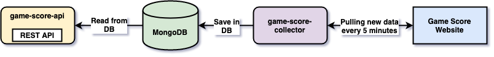

# springboot-jsoup-html-parser

The goal of this project is to get a list of games and their scores from a website. The application must parse the website HTML content, get the necessary information, save the data in a database and expose them through a REST API.

> **Note:** In [`kubernetes-minikube-environment`](https://github.com/ivangfr/kubernetes-minikube-environment/tree/master/html-parser-job-cronjob) repository, it's shown how to deploy this project in `Kubernetes` (`Minikube`)

## Project Diagram



## Applications

- ### game-score-api

  [`Spring Boot`](https://docs.spring.io/spring-boot/docs/current/reference/htmlsingle/) Java Web application that exposes a REST API from where clients can retrieve the game score data stored in `MongoDB` database.

  | Endpoints                 | Description                                                  |
  | ------------------------- | ------------------------------------------------------------ |
  | `GET /api/games [?title]` | returns all game scores or filtered by title with pagination |
  | `GET /api/games/{id}`     | returns a specific game score filtered by id                 |

- ### game-score-collector

  `Spring Boot` Java application responsible for calling the game score website, parse the HTML content (using [`jsoup`](https://jsoup.org/)) and save the data in [`MongoDB`](https://www.mongodb.com/) database. It will be configured to run from time to time in order to keep the application updated about the information the website provides. 

## Prerequisites

- [`Java 11+`](https://www.oracle.com/java/technologies/javase-jdk11-downloads.html)
- [`Docker`](https://www.docker.com/)
- [`Docker-Compose`](https://docs.docker.com/compose/install/)

## Start environment

- Open a terminal and navigate to `springboot-jsoup-html-parser` root folder

- Run the command below to start a `MongoDB` Docker container at port `27017`
  ```
  docker-compose up -d
  ```

## Running Applications with Maven

- In a terminal, make sure you are inside `springboot-jsoup-html-parser` root folder

- Execute the following command to run `game-score-collector`
  ```
  ./mvnw clean spring-boot:run --projects game-score-collector \
    -Dspring-boot.run.jvmArguments="-Dspring.data.mongodb.username=gamescoreuser -Dspring.data.mongodb.password=gamescorepass"
  ```
  `game-score-collector` is a Java application that does its job and terminates. Ideally, it will be executed as a cronjob, scheduled to run during specific time intervals.

- Execute the command below to run `game-score-api`
  ```
  ./mvnw clean spring-boot:run --projects game-score-api \
    -Dspring-boot.run.jvmArguments="-Dspring.data.mongodb.username=gamescoreuser -Dspring.data.mongodb.password=gamescorepass"
  ```

## Running Applications as Docker containers

### Build Application’s Docker Image

- In a terminal, make sure you are in `springboot-jsoup-html-parser` root folder

- Run the following script to build the Docker images
  - JVM
    ```
    ./build-apps.sh
    ```
  - Native (it's not working yet, see [Issues](#issues))
    ```
    ./build-apps.sh native
    ```
  
### Application’s Environment Variables

- **game-score-api**

  | Environment Variable | Description                                                       |
  | -------------------- | ----------------------------------------------------------------- |
  | `MONGODB_HOST`       | Specify host of the `Mongo` database to use (default `localhost`) |
  | `MONGODB_PORT`       | Specify port of the `Mongo` database to use (default `27017`)     |

- **game-score-collector**

  | Environment Variable | Description                                                       |
  | -------------------- | ----------------------------------------------------------------- |
  | `MONGODB_HOST`       | Specify host of the `Mongo` database to use (default `localhost`) |
  | `MONGODB_PORT`       | Specify port of the `Mongo` database to use (default `27017`)     |

### Start Application’s Docker Container

- In a terminal, execute the command below to run `game-score-collector` Docker container
  ```
  docker run --rm \
    --name game-score-collector \
    --network=springboot-jsoup-html-parser_default \
    --env MONGODB_HOST=mongodb \
    --env SPRING_DATA_MONGODB_USERNAME=gamescoreuser \
    --env SPRING_DATA_MONGODB_PASSWORD=gamescorepass \
    docker.mycompany.com/game-score-collector:1.0.0
  ```

- Then, execute the following command to run `game-score-api` Docker container in detached mode
  ```
  docker run -d --rm -p 8080:8080 \
    --name game-score-api \
    --network=springboot-jsoup-html-parser_default \
    --env MONGODB_HOST=mongodb \
    --env SPRING_DATA_MONGODB_USERNAME=gamescoreuser \
    --env SPRING_DATA_MONGODB_PASSWORD=gamescorepass \
    docker.mycompany.com/game-score-api:1.0.0
  ```

## Testing

- A fast way to test the application is by calling a `game-score-api` endpoint using `curl`.

  For instance, the command below returns the game score results with pagination: page 0, size 10, sorted descending by `score` field.
  ```
  curl -i "http://localhost:8080/api/games?page=0&size=10&sort=score%2Cdesc"
  ```

- You can access `game-score-api` Swagger at http://localhost:8080

## Useful Commands

- **MongoDB**

  List all game scores
  ```
  docker exec -it mongodb mongo -ugamescoreuser -pgamescorepass --authenticationDatabase gamescoredb
  use gamescoredb
  db.gamescores.find()
  db.gamescores.getIndexes()
  ```
  > Type `exit` to get out of MongoDB shell

## Shutdown

- Stop `game-score-api`
  - If it was started with `Maven`, go to the terminal where it is running and press `Ctrl+C`
  - If it was started as a Docker container, run the following command in a terminal
    ```
    docker stop game-score-api
    ```

- Stop and remove docker-compose containers, networks and volumes
  ```
  docker-compose down -v
  ```

## Running Tests

Both `game-score-api` and `game-score-collector` have a set of test cases. In order to run them

- In a terminal, make sure you are inside `springboot-jsoup-html-parser` root folder

- Execute the following command
  ```
  ./mvnw clean test
  ```

## Issues

- In `game-score-collector`, the `hibernate-validator` dependency is commented out as it isn't working in docker native image. Maybe, it's related to [issues #417](https://github.com/spring-projects-experimental/spring-graalvm-native/issues/417). The exception is
  ```
  ERROR 1 --- [           main] o.s.b.d.LoggingFailureAnalysisReporter   :
  
  ***************************
  APPLICATION FAILED TO START
  ***************************
  
  Description:
  
  Failed to bind properties under 'app' to com.mycompany.gamescorecollector.properties.CollectorProperties:
  
      Reason: org.hibernate.validator.internal.constraintvalidators.bv.NotNullValidator.<init>()
  
  Action:
  
  Update your application's configuration
  ```

- The `game-score-api` docker native image builds successfully but, an exception is thrown at runtime. Maybe, it's related to this [issue #372](https://github.com/spring-projects-experimental/spring-graalvm-native/issues/372)
  ```
  ERROR 1 --- [           main] o.s.boot.SpringApplication               : Application run failed
  
  org.springframework.beans.factory.BeanDefinitionStoreException: Failed to process import candidates for configuration class [org.springframework.boot.autoconfigure.data.web.SpringDataWebAutoConfiguration]; nested exception is java.io.FileNotFoundException: class path resource [org/springframework/data/mongodb/config/GeoJsonConfiguration.class] cannot be opened because it does not exist
  	at org.springframework.context.annotation.ConfigurationClassParser.processImports(ConfigurationClassParser.java:610) ~[na:na]
  	at org.springframework.context.annotation.ConfigurationClassParser.doProcessConfigurationClass(ConfigurationClassParser.java:311) ~[na:na]
  	at org.springframework.context.annotation.ConfigurationClassParser.processConfigurationClass(ConfigurationClassParser.java:250) ~[na:na]
  	at org.springframework.context.annotation.ConfigurationClassParser.processImports(ConfigurationClassParser.java:600) ~[na:na]
  	at org.springframework.context.annotation.ConfigurationClassParser.access$800(ConfigurationClassParser.java:111) ~[na:na]
  	at org.springframework.context.annotation.ConfigurationClassParser$DeferredImportSelectorGroupingHandler.lambda$processGroupImports$1(ConfigurationClassParser.java:812) ~[na:na]
  	at java.util.ArrayList.forEach(ArrayList.java:1541) ~[com.mycompany.gamescoreapi.GameScoreApiApplication:na]
  	at org.springframework.context.annotation.ConfigurationClassParser$DeferredImportSelectorGroupingHandler.processGroupImports(ConfigurationClassParser.java:809) ~[na:na]
  	at org.springframework.context.annotation.ConfigurationClassParser$DeferredImportSelectorHandler.process(ConfigurationClassParser.java:780) ~[na:na]
  	at org.springframework.context.annotation.ConfigurationClassParser.parse(ConfigurationClassParser.java:193) ~[na:na]
  	at org.springframework.context.annotation.ConfigurationClassPostProcessor.processConfigBeanDefinitions(ConfigurationClassPostProcessor.java:336) ~[com.mycompany.gamescoreapi.GameScoreApiApplication:5.3.2]
  	at org.springframework.context.annotation.ConfigurationClassPostProcessor.postProcessBeanDefinitionRegistry(ConfigurationClassPostProcessor.java:252) ~[com.mycompany.gamescoreapi.GameScoreApiApplication:5.3.2]
  	at org.springframework.context.support.PostProcessorRegistrationDelegate.invokeBeanDefinitionRegistryPostProcessors(PostProcessorRegistrationDelegate.java:285) ~[na:na]
  	at org.springframework.context.support.PostProcessorRegistrationDelegate.invokeBeanFactoryPostProcessors(PostProcessorRegistrationDelegate.java:99) ~[na:na]
  	at org.springframework.context.support.AbstractApplicationContext.invokeBeanFactoryPostProcessors(AbstractApplicationContext.java:751) ~[na:na]
  	at org.springframework.context.support.AbstractApplicationContext.refresh(AbstractApplicationContext.java:569) ~[na:na]
  	at org.springframework.boot.web.servlet.context.ServletWebServerApplicationContext.refresh(ServletWebServerApplicationContext.java:144) ~[na:na]
  	at org.springframework.boot.SpringApplication.refresh(SpringApplication.java:767) ~[com.mycompany.gamescoreapi.GameScoreApiApplication:2.4.1]
  	at org.springframework.boot.SpringApplication.refresh(SpringApplication.java:759) ~[com.mycompany.gamescoreapi.GameScoreApiApplication:2.4.1]
  	at org.springframework.boot.SpringApplication.refreshContext(SpringApplication.java:426) ~[com.mycompany.gamescoreapi.GameScoreApiApplication:2.4.1]
  	at org.springframework.boot.SpringApplication.run(SpringApplication.java:326) ~[com.mycompany.gamescoreapi.GameScoreApiApplication:2.4.1]
  	at org.springframework.boot.SpringApplication.run(SpringApplication.java:1309) ~[com.mycompany.gamescoreapi.GameScoreApiApplication:2.4.1]
  	at org.springframework.boot.SpringApplication.run(SpringApplication.java:1298) ~[com.mycompany.gamescoreapi.GameScoreApiApplication:2.4.1]
  	at com.mycompany.gamescoreapi.GameScoreApiApplication.main(GameScoreApiApplication.java:12) ~[com.mycompany.gamescoreapi.GameScoreApiApplication:na]
  Caused by: java.io.FileNotFoundException: class path resource [org/springframework/data/mongodb/config/GeoJsonConfiguration.class] cannot be opened because it does not exist
  	at org.springframework.core.io.ClassPathResource.getInputStream(ClassPathResource.java:180) ~[na:na]
  	at org.springframework.core.type.classreading.SimpleMetadataReader.getClassReader(SimpleMetadataReader.java:55) ~[na:na]
  	at org.springframework.core.type.classreading.SimpleMetadataReader.<init>(SimpleMetadataReader.java:49) ~[na:na]
  	at org.springframework.core.type.classreading.SimpleMetadataReaderFactory.getMetadataReader(SimpleMetadataReaderFactory.java:103) ~[na:na]
  	at org.springframework.boot.type.classreading.ConcurrentReferenceCachingMetadataReaderFactory.createMetadataReader(ConcurrentReferenceCachingMetadataReaderFactory.java:86) ~[na:na]
  	at org.springframework.boot.type.classreading.ConcurrentReferenceCachingMetadataReaderFactory.getMetadataReader(ConcurrentReferenceCachingMetadataReaderFactory.java:73) ~[na:na]
  	at org.springframework.core.type.classreading.SimpleMetadataReaderFactory.getMetadataReader(SimpleMetadataReaderFactory.java:81) ~[na:na]
  	at org.springframework.context.annotation.ConfigurationClassParser.asSourceClass(ConfigurationClassParser.java:696) ~[na:na]
  	at org.springframework.context.annotation.ConfigurationClassParser.asSourceClasses(ConfigurationClassParser.java:675) ~[na:na]
  	at org.springframework.context.annotation.ConfigurationClassParser.processImports(ConfigurationClassParser.java:582) ~[na:na]
  	... 23 common frames omitted
  ```
 